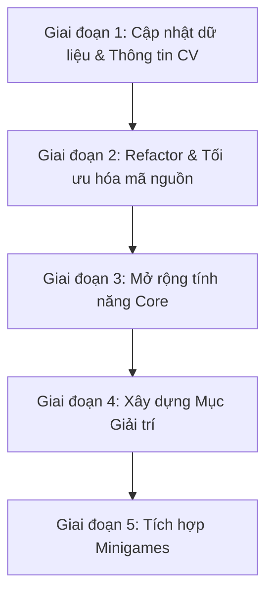

# Lộ trình (Roadmap) phát triển & nâng cấp Website Portfolio

Tài liệu này phác thảo toàn bộ quy trình công việc và lộ trình thực hiện để cập nhật thông tin cá nhân, cải tiến giao diện, tối ưu hóa mã nguồn, mở rộng tính năng và tích hợp các tiện ích giải trí/trò chơi trên website Portfolio của **Võ Mạnh Khánh**.

---

## 📅 Tổng quan Lộ trình thực hiện

Lộ trình được chia làm **5 giai đoạn chính**:

### 1. Giai đoạn 1: Cập nhật dữ liệu & Thông tin CV
*   **Mục tiêu**: Điều chỉnh toàn bộ thông tin tĩnh và động trên giao diện trùng khớp hoàn toàn với hồ sơ năng lực thực tế trong CV PDF.
*   **Tệp kế hoạch chi tiết**: [plans/01-update-info.md](file:///c:/CongViec/profiles-source/plans/01-update-info.md)

### 2. Giai đoạn 2: Tối ưu hóa giao diện (Style & Layout)
*   **Mục tiêu**: Tối ưu hóa trải nghiệm người dùng (UX/UI), cải thiện hiệu ứng chuyển động (micro-interactions), tinh chỉnh hệ thống màu sắc (skins) và tăng cường hiển thị trên thiết bị di động.
*   **Tệp kế hoạch chi tiết**: [plans/02-style-layout.md](file:///c:/CongViec/profiles-source/plans/02-style-layout.md)

### 3. Giai đoạn 3: Refactor mã nguồn (Code Quality)
*   **Mục tiêu**: Tổ chức lại thư mục dự án, tách logic nghiệp vụ khỏi UI (Custom Hooks), nâng cấp TypeScript types và tối ưu hóa tốc độ tải trang tĩnh (static export).
*   **Tệp kế hoạch chi tiết**: [plans/03-refactor-code.md](file:///c:/CongViec/profiles-source/plans/03-refactor-code.md)

### 4. Giai đoạn 4: Mở rộng tính năng Core
*   **Mục tiêu**: Nâng cấp các tính năng hiện tại như lọc Portfolio động, bộ điều hướng Layout thông minh, hệ thống gửi email liên hệ tự động và tải xuống CV động.
*   **Tệp kế hoạch chi tiết**: [plans/04-expand-features.md](file:///c:/CongViec/profiles-source/plans/04-expand-features.md)

### 5. Giai đoạn 5: Xây dựng chuyên mục Giải trí (Entertainment Hub)
*   **Mục tiêu**: Thêm một phân hệ mới để chia sẻ thông tin vui nhộn về cuộc sống, thể thao, phim ảnh cùng các chức năng tương tác giải trí.
*   **Tệp kế hoạch chi tiết**: [plans/05-entertainment.md](file:///c:/CongViec/profiles-source/plans/05-entertainment.md)

### 6. Giai đoạn 6: Tích hợp các Trò chơi nhỏ (Minigames)
*   **Mục tiêu**: Lập trình trực tiếp các minigame tương tác (như Rắn săn mồi, Xếp hình Tetris) bằng React/TypeScript/Tailwind CSS ngay trên giao diện web.
*   **Tệp kế hoạch chi tiết**: [plans/06-minigames.md](file:///c:/CongViec/profiles-source/plans/06-minigames.md)

---

## 🛠️ Hướng dẫn Theo dõi và Thực hiện
1. Các tệp kế hoạch được viết dưới dạng Markdown độc lập, nằm trong thư mục [plans/](file:///c:/CongViec/profiles-source/plans/).
2. Mỗi tệp kế hoạch chứa danh sách các bước thực hiện cụ thể, mã nguồn dự kiến cần thay đổi và phương án kiểm thử để đảm bảo tính đúng đắn.
3. Nhà phát triển có thể thực hiện tuần tự theo lộ trình hoặc triển khai song song tùy theo độ ưu tiên của dự án.
